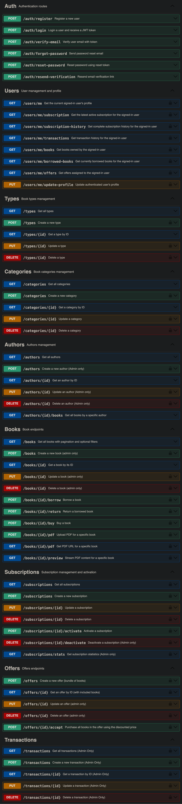

# Digital Library API 📚

A comprehensive, feature-rich backend API for a modern digital library system built with Node.js, Express, and MongoDB. This API powers a complete online library ecosystem with user authentication, book management, subscription-based borrowing, purchasing, special offers, and comprehensive admin controls.

## 🌟 Key Features

- **Library**: Manage books (authors, categories, types), search with pagination, PDF upload and controlled access.
- **Users & auth**: JWT login, email verification/reset, password forget/reset, profiles, pre-save hook for password hashing, and admin role-based access.
- **Monetization**: Buy, borrow per-day, subscriptions with quotas, time‑limited offers, wallet and transactions.
- **Engineering**: MongoDB transactions, Joi validation, rate limiting protection, Swagger docs, and secure file uploads.

## 🛠️ Tech Stack

### **Backend Framework**
- **Node.js** - JavaScript runtime environment
- **Express.js** - Fast, unopinionated web framework
- **MongoDB** - NoSQL database with replica set support

### **Authentication & Security**
- **JWT (jsonwebtoken)** - Stateless authentication tokens
- **bcryptjs** - Password hashing and salting
- **Crypto** - Token generation for email verification and password reset
- **express-rate-limit** - Rate limiting middleware for API protection

### **External Libraries**
- **Joi** - Object schema validation
- **Swagger-ui** - API documentation
- **Nodemailer** - Email service integration
- **express-rate-limit** - limit the rate of requests

## 📚 API Documentation

- **Swagger UI:** You can view and all the endpoints from here https://digital-library-api.vercel.app/api-docs
- **Postman 🧑🏻‍🚀:** You can download and import the Postman JSON file from [here](assets/Digital-Library-API.postman_collection.json)



## 📋 Prerequisites

- **Node.js** (v18.x or later)
- **npm** (v8.x or later)
- **MongoDB** (local replica set or MongoDB Atlas)
- **Email Service** (SMTP credentials for notifications)

## 🚀 Installation & Setup

### 1. Clone the Repository
```bash
git clone https://github.com/r6mez/Digital-Library-API.git
cd Digital-Library-API
```

### 2. Install Dependencies
```bash
npm install
```

### 3. Environment Configuration
Create a `.env` file in the root directory, look for `.env.example` file for more guidance

### 4. Database Setup
```bash
# Seed the database with sample data
npm run seed
```

### 5. Start the Application
```bash
# Development mode with auto-restart
npm start

# The server will be running on http://localhost:5001
```

## Built with ❤️ by 

- **Ramez Medhat** - [GitHub Profile](https://github.com/r6mez)
- **Zeyad Zahran** - [GitHub Profile](https://github.com/Zeyadzahran)
- **Mostafa Mahmoad** - [Github Profile](https://github.com/Mostafa2115)


